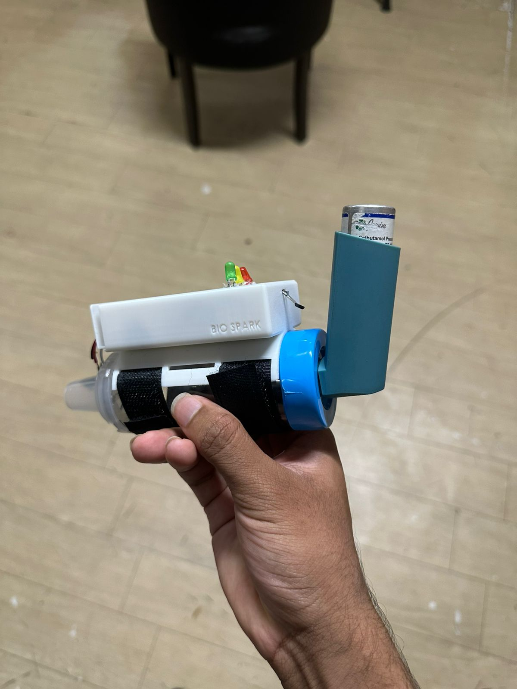
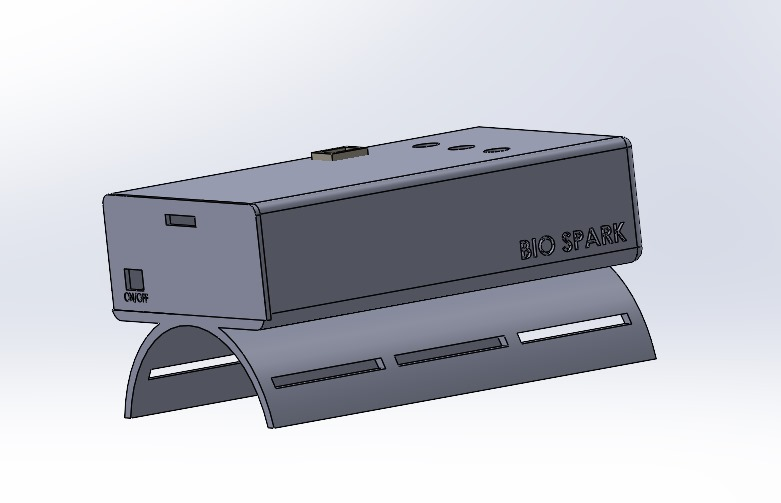
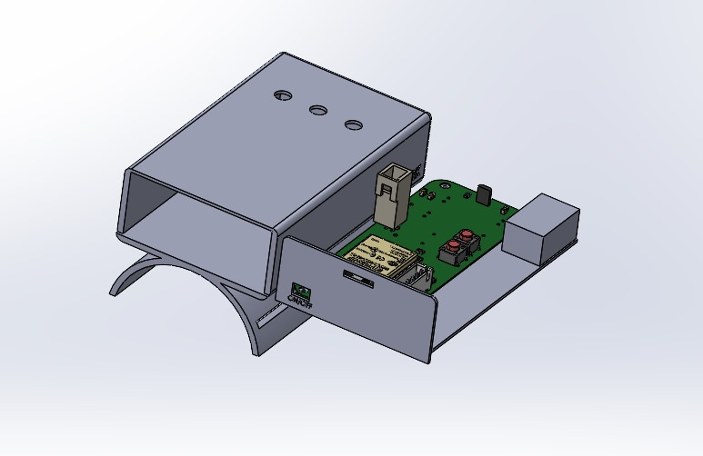
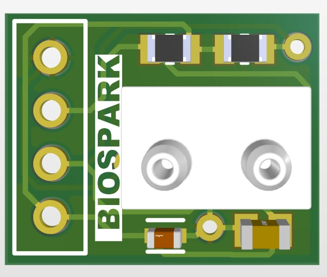
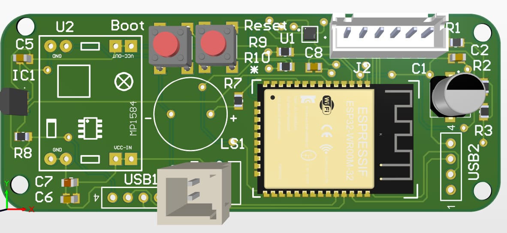

# 🌬️ Smart Spacer for Asthma Management
Incorrect inhaler technique is a common but often overlooked issue in respiratory care. To address this, we developed Smart Breath Buddy, an IoT-driven system that monitors inhalation behavior and device usage through sensor data.

---
## 📸 Project Images

 

 ---

## 🎯 Project Goals

- Monitor real-time inhaler usage
- Detect and improve incorrect inhalation techniques
- Provide accessible, visual feedback via a web dashboard
- Reduce workload for healthcare professionals

---

## 🧠 Key Features

- ✅ Real-time sensor monitoring: Tracks inhalation patterns and device usage
- 🔧 ESP32-based firmware: Securely transmits data to the cloud
- 🖥️ Web application dashboard: Visualizes and manages device data
- 🔗 Full device → cloud → web workflow: End-to-end integration

---

## 🛠️ Design & Fabrication

- 💻 ESP32 microcontroller for IoT data acquisition
- ☁️ Cloud integration for storage and analytics
- 📱 Web application built to visualize and manage patient/device data
- 🧩 System-level integration: Ensures reliable and secure communication between device, cloud, and application

---
## 📸 Enclosure Design

 
 

---
## 📸 PCB Design

 
 

---

## 👨‍🔬 Developed By

**Rasula Geesara / Pamodhya Wijesinghe / Thisura Samuditha**  

---
